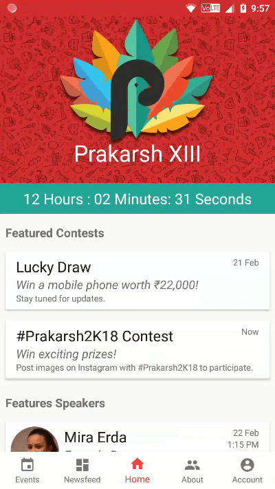
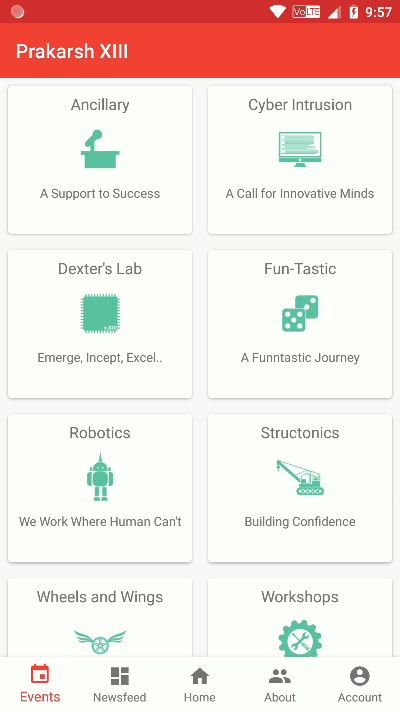
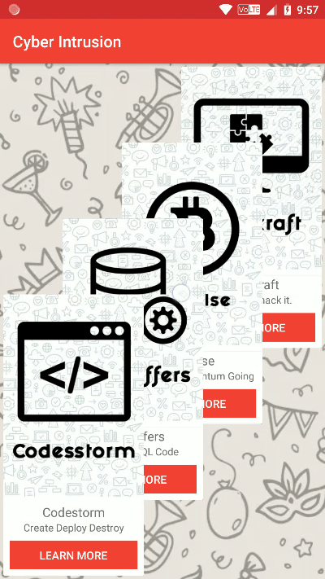
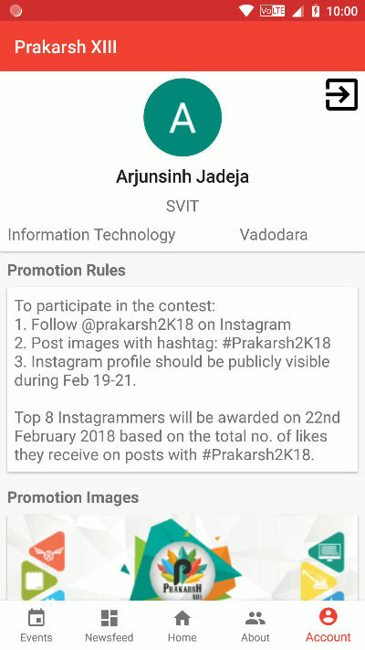

# PrakarshApp
Application for Prakarsh XIII (2018) Fest.

This app uses JSON files from [PrakarshJSON](https://github.com/SvitPrakarsh/PrakarshJSON) project hosted with Github Pages.

## Home and About

<span>


</span>

## Events

<span>



</span>

## Account and News

<span>


</span>

## Links

[Play Store](https://play.google.com/store/apps/details?id=in.ac.svit.prakarsh) |	
[Github Releases](https://github.com/itsarjunsinh/PrakarshApp/releases)

## Firebase Configuration

### Prerequisites 

* Create a new Firebase project.
* Add google-services.json to "PrakarshApp/app" folder. [(Firebase Documentation)](https://firebase.google.com/docs/android/setup#manually_add_firebase)
* Add your app's SHA-1 fingerprint and enable Google Sign-In. [(Firebase Documentation)](https://firebase.google.com/docs/auth/android/google-signin#before_you_begin)
* Add Google sign-in client ID in google_login_web_client_id (/res/values/appids.xml) [(Firebase Documentation)](https://firebase.google.com/docs/auth/android/google-signin#authenticate_with_firebase)

### Firestore Database Structure 

**users** -> [Unique User ID] -> (fields) city, collegeName, department, email, name, phoneNumber

*Create "users" collection using the Firebase  console. The UUID documents and the details fields will automatically be generated from the client side.*

**newsfeed** -> [FB Post ID] -> (fields) caption, date, imageUrl, time

*All posts must be added manually. In the future the data will be fetched through a script.*

### Firestore Database Rules

```
service cloud.firestore {
  match /databases/{database}/documents {
    match /users/{userID} {
      allow create, update, read: if request.auth.uid == userID;
    }
    match /newsfeed/{document=**} {
      allow read;
    }
  }
}
```
